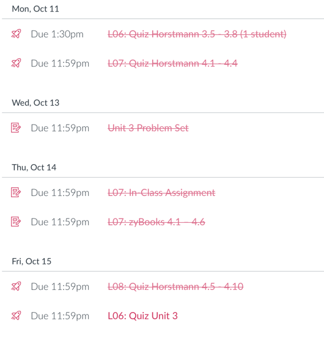
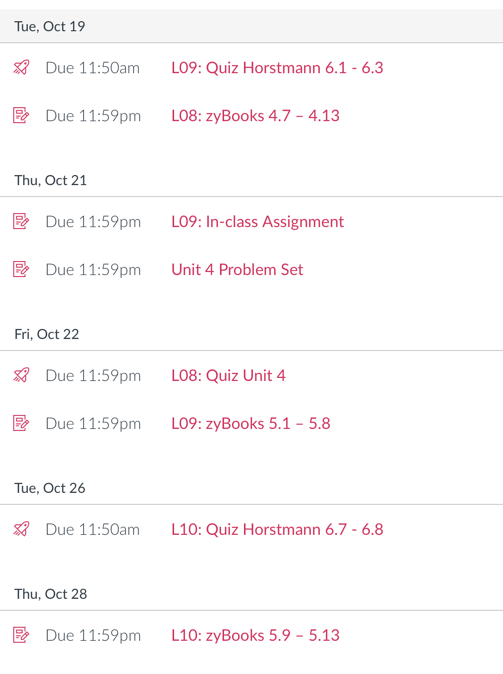

##IST 140 - Tuesday, October 19

### The Past

### The Future

### Today

* [ ] Attendance Code: 2860
* [ ] Time to work on [L08: zyBooks 4.7 – 4.13](https://psu.instructure.com/courses/2148132/assignments/13315949) (due 11:59p tonight)
	* This covers the remainder of the material on loops, including loops nad strings, nested loops, break and continue, variable name scope, and enumerations (the last of which is surprisingly handy).
* [ ] Time to work on [Unit 4 Problem Set](https://psu.instructure.com/courses/2148132/assignments/13315983) (due 11:59p Thursday)
* [ ] Time to work on [L09: zyBooks 5.1 – 5.8](https://psu.instructure.com/courses/2148132/assignments/13315953) (due 11:59p on Friday)
	* This covers our introduction to arrays, which is also covered in Horstmann 6.1–6.3, and thus the reading quiz today.
* [ ] [L09: Quiz Horstmann 6.1 - 6.3](https://psu.instructure.com/courses/2148132/assignments/13315927) (taken at the end of class today)